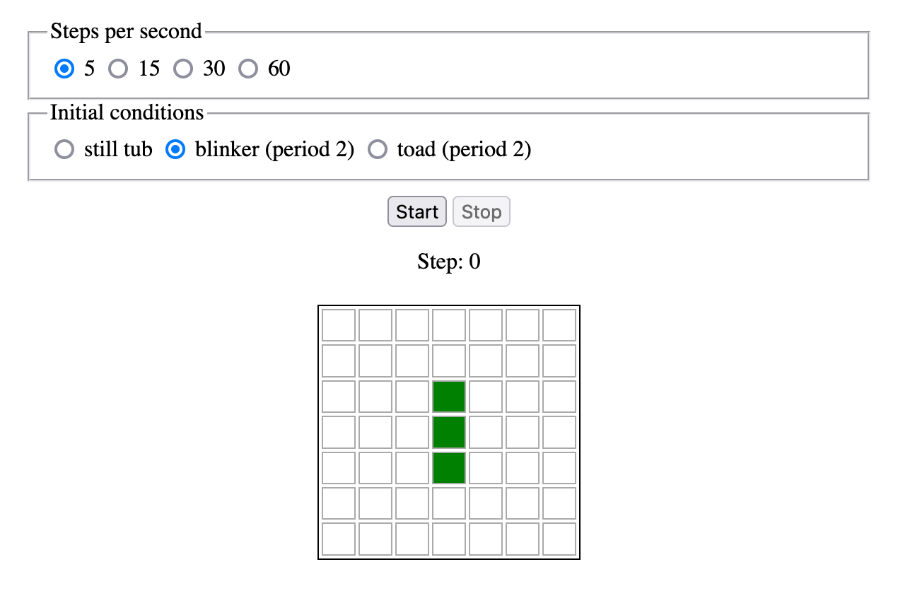

# Game of Life in Javascript using MVC

This projects implements
[Conway's Game of Life](https://en.wikipedia.org/wiki/Conway%27s_Game_of_Life)
in Javascript.

The main goal for this project was to practice writing Javascript code.
Besides that, I wanted to get an experience writing interactive programs
(based on event loop) in contrast to batch programs that I usually write.

While implementing this project, I was interested in learning how to organize
code cleanly using
Model-View-Controller architectural principle
(see, for example,
[Wikipedia page](https://en.wikipedia.org/wiki/Model%E2%80%93view%E2%80%93controller)
for an introduction to this pattern).